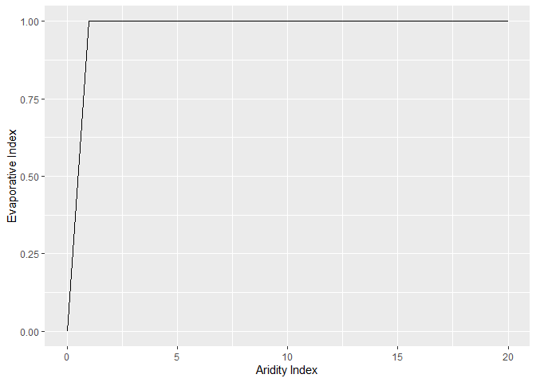
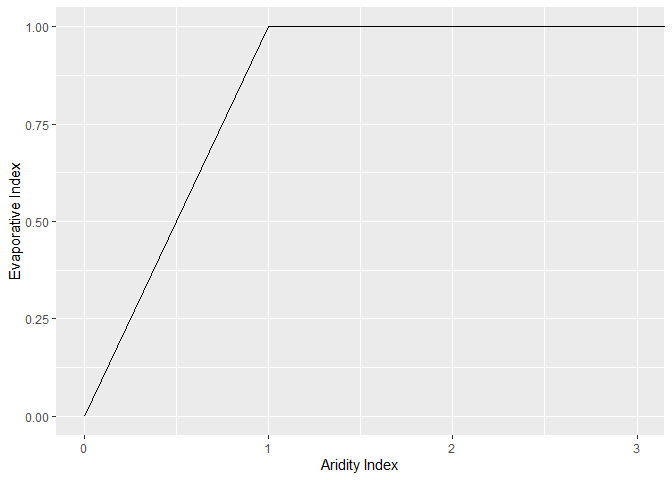
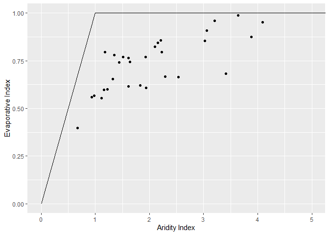
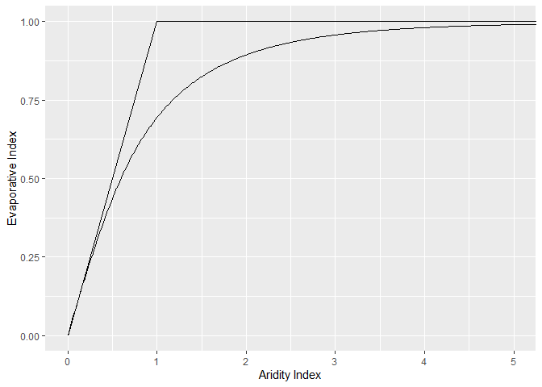
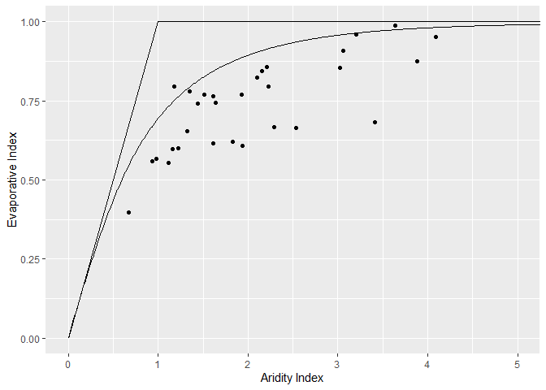
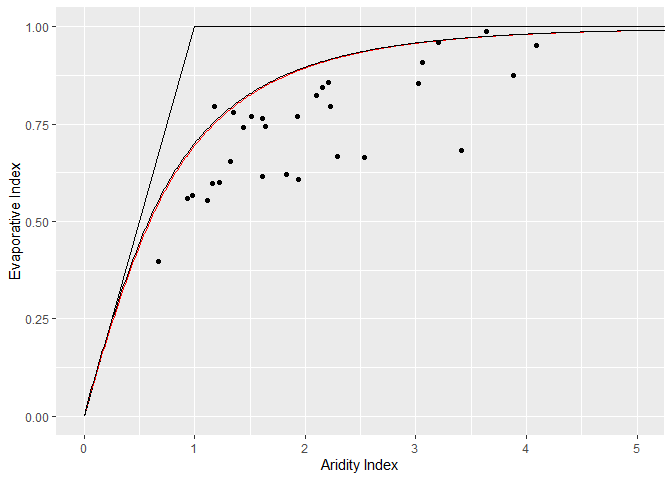

<!-- README.md is generated from README.Rmd. Please edit that file -->

# budyko

The goal of `budyko` is to facilitate fitting of hydrologic data to
Budyko-type curves. The package includes the original Budyko (1974)
formulation, as well as several single-parameter formulations like those
of Fu (1981), Turc (1954), Pike (1964), and Wang & Tang (2014).

## Installation

You can install budyko from github using devtools:

``` r
devtools::install_github("tylerbhampton/budykoR")
```

## Sample Plots and Data

We can use the function `blankBC` to create a blank Budyko Curve plot,
which includes the energy and water boundaries.

``` r
library(ggplot2)
library(budyko)

blankBC
```

<!-- -->

``` r
blankBC+coord_cartesian(xlim=c(0,3))
```

<!-- -->

The package comes with a sample dataset. This is annual Water-Year
(October through September) data for 30 years. blankBC has pre-set
aesthetics for columns `PET.P` on the x axis and `AET.P` on the y axis.
We can simply add `testdata` to the plot.

``` r
testdata=budyko::testdata
head(testdata)
#>   year     PET.P     AET.P
#> 1 1971 1.3544730 0.7792568
#> 2 1972 1.2196014 0.5995881
#> 3 1973 2.2301358 0.7945747
#> 4 1974 1.9327838 0.7699053
#> 5 1975 0.9333194 0.5579104
#> 6 1976 2.1029359 0.8223432
blankBC+geom_point(data=testdata)+coord_cartesian(xlim=c(0,5))
```

<!-- -->

## Curves and Curve Fitting

The package contains several Budyko-type curves. We can use the default
setting of `budyko_sim()` to generate the original Budyko curve.

``` r
ogbudyko=budyko_sim()
blankBC+geom_line(data=ogbudyko)+coord_cartesian(xlim=c(0,5))
```

<!-- -->

``` r
blankBC+
  geom_line(data=ogbudyko)+
  geom_point(data=testdata)+
  coord_cartesian(xlim=c(0,5))
```

<!-- -->

We can also use `budyko_fit()` to custom fit the data.

``` r
fit1=budyko_fit(data=testdata,method="Fu",dif="mae",silent = TRUE)
fit1
#>           Fu
#> param 2.0500
#> mae   0.0698
#> rsq   0.6139
#> hs    0.0000
sim1=budyko_sim(fit=fit1)
blankBC+
  geom_line(data=ogbudyko,col=2)+
  geom_line(data=sim1)+
  geom_point(data=testdata)+
  coord_cartesian(xlim=c(0,5))
```

<!-- -->
